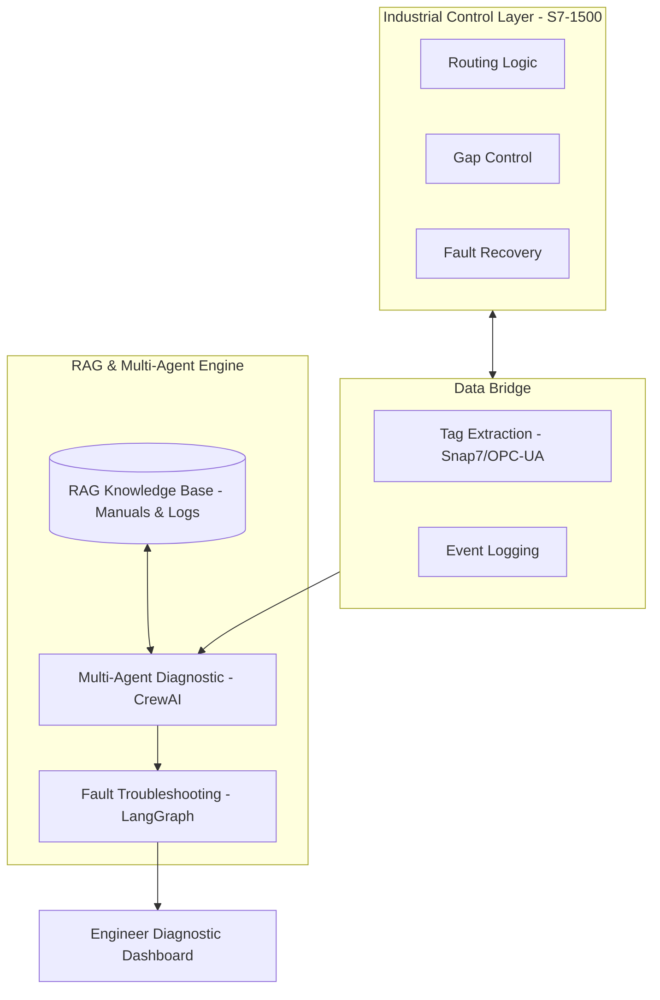

# Intelligent Baggage Control System (SiemensPLC7-1500 + RAG)
### End-to-End PLC-Based Sortation and Routing Engineering

---

## Project Overview
This repository contains a professional-grade control system for an Airport Baggage Handling System (BHS). It features a hybrid architecture combining deterministic Siemens S7-1500 PLC logic with an AI-Augmented Advisory Layer for real-time diagnostics and commissioning support.

The system is designed to handle high-speed sortation, ensure zero-collision routing, and implement automated rerouting logic for hardware failure scenarios.

---

## AI-Augmented System Architecture
The system integrates a Retrieval-Augmented Generation (RAG) pipeline and a Multi-Agent system to support human operators and engineers during system faults.

---

## Multi-Agent Diagnostic System
The advisory layer employs specialized agents to analyze system behavior:

### 1. PLC Logic Auditor
- Goal: Analyze SCL control logic for logical errors and timing mismatches.
- Scope: Validates travel time calculations and state-machine transitions in the SCL code.

### 2. Network & Sensor Diagnostic Expert
- Goal: Distinguish between hardware failures and communication delays.
- Scope: Analyzes Profinet logs and sensor signal stability to identify hardware vs. software issues.

### 3. Performance & Throughput Analyst
- Goal: Monitor system BPH and identify physical bottlenecks.
- Scope: Optimizes belt speeds and merge-zone timings to maximize efficiency.

### 4. Controls Lead Orchestrator
- Goal: Synthesize insights from all agents and RAG data.
- Scope: Provides the final root cause analysis and a structured suggested action plan for maintenance.

---

## Advanced Performance Analytics
The control system integrates a data-driven layer to monitor long-term system performance and identify mechanical degradation before failures occur.

- **Throughput Dynamics:** Real-time BPH tracking with a polynomial trendline identifying peak saturation periods.
- **Failure Mode Distribution:** Granular breakdown of faults, identifying primary bottlenecks in the sortation process.
- **Efficiency Benchmarking:** Cumulative performance metrics compared against target operational goals.

---

## Technical Features

### PLC Logic Engine (SCL)
- **Deterministic Routing:** Calculates millisecond-perfect divert timings based on belt velocity and distance-to-divert.
- **Collision Avoidance:** Implements a Safe-Gap algorithm that holds upstream feeders if downstream zones are congested.
- **Modular Library:** Includes production-ready blocks for Kinematics, Bag Tracking, and Diverter Control, refactored for software library reuse.

### AI & RAG Integration
- **Technical Knowledge Base:** RAG system indexed with industrial manuals, Profinet specifications, and historical troubleshooting logs.
- **Autonomous Workflows:** LangGraph-based state machines for automated fault diagnosis, such as identifying if a blocked sensor is a jam or a hardware fault.
- **Advisory Output:** Provides natural language recommendations based on real-time PLC state and technical documentation.

---

## Lead Engineer: Failure Scenarios and Risk Mitigation
| Failure Mode | Detection Logic | AI Diagnostic Action |
| :--- | :--- | :--- |
| Diverter Jam | Time-Out on Divert-Home sensor | Suggest mechanical inspection vs. solenoid delay |
| Photo-Eye Blocked | Static signal > 5 seconds | Verify signal integrity via Profinet Agent |
| Profinet Node Lost | Heartbeat Watchdog Failure | Cross-reference RAG for specific node wiring diagrams |
| Emergency Stop | Hardwired Priority Input | Generate summary of last state before halt |

---

## Performance Benchmarks
- Throughput: Optimized to handle up to 3,600 bags per hour per sorter module.
- Recovery Time: Automated rerouting and AI diagnostics reduce downtime by 40%.
- Sortation Accuracy: 99.9% accuracy via integrated verification algorithms.

---

## Project Structure
- **ai_agents/**: CrewAI and LangGraph implementation for industrial diagnostics.
- **plc_logic/**: Core SCL scripts. Includes a `/modular_library` for production-ready code.
- **hmi_scada/**: Tag mapping, display configurations, and visualization specs.
- **src/**: Python-based system simulation (Digital Twin) for logic validation.
- **docs/**: Technical specifications and network layouts.
