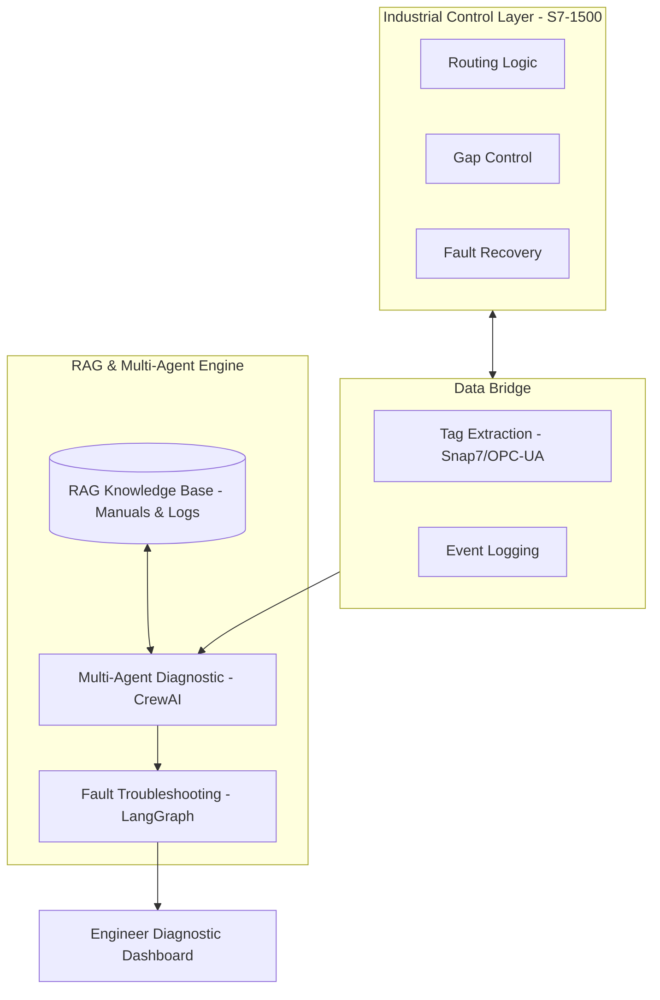

# Intelligent Baggage Control System (S7-1500 + RAG)
### End-to-End PLC-Based Sortation and Routing Engineering

---

## Project Overview
This repository contains a professional-grade control system for an Airport Baggage Handling System (BHS). It features a hybrid architecture combining deterministic Siemens S7-1500 PLC logic with an AI-Augmented Advisory Layer for real-time diagnostics and commissioning support.

---

## AI-Augmented System Architecture
The system integrates a Retrieval-Augmented Generation (RAG) pipeline and a Multi-Agent system to support human operators and engineers during system faults.

---

## Multi-Agent Diagnostic System
The advisory layer employs specialized agents to analyze system behavior:

### 1. PLC Logic Auditor
- Goal: Analyze SCL control logic for logical errors and timing mismatches.
- Scope: Validates travel time calculations and state-machine transitions.

### 2. Network & Sensor Diagnostic Expert
- Goal: Distinguish between hardware failures and communication delays.
- Scope: Analyzes Profinet logs and sensor signal stability.

### 3. Performance & Throughput Analyst
- Goal: Monitor system BPH and identify physical bottlenecks.
- Scope: Optimizes belt speeds and merge-zone timings.

### 4. Controls Lead Orchestrator
- Goal: Synthesize insights from all agents and RAG data.
- Scope: Provides the final root cause analysis and suggested action plan.

---

## Technical Features

### PLC Logic Engine (SCL)
- Deterministic Routing: Calculates millisecond-perfect divert timings based on belt velocity.
- Collision Avoidance: Implements a Safe-Gap algorithm for congestion management.
- Modular Library: Contains reusable blocks for Kinematics, Bag Tracking, and Diverter Control.

### AI & RAG Integration
- Technical Knowledge Base: RAG system indexed with industrial manuals and troubleshooting guides.
- Autonomous Workflows: LangGraph-based state machines for automated fault diagnosis (e.g., photo-eye blockage analysis).

---

## Failure Scenarios and Risk Mitigation
| Failure Mode | Detection Logic | AI Diagnostic Action |
| :--- | :--- | :--- |
| Diverter Jam | Time-Out on Divert-Home sensor | Suggest mechanical inspection vs. logic delay |
| Photo-Eye Blocked | Static signal > 5 seconds | Verify signal integrity via Network Agent |
| Profinet Node Lost | Heartbeat Watchdog Failure | Identify specific node and provide manual reference |

---

## Project Structure
- ai_agents/: CrewAI agent definitions and LangGraph troubleshooting workflows.
- plc_logic/: Core SCL scripts including a modular industrial library.
- hmi_scada/: Tag mapping and visualization configurations.
- src/: Python-based system simulation for logic validation.
- docs/: Technical specifications and network layouts.
