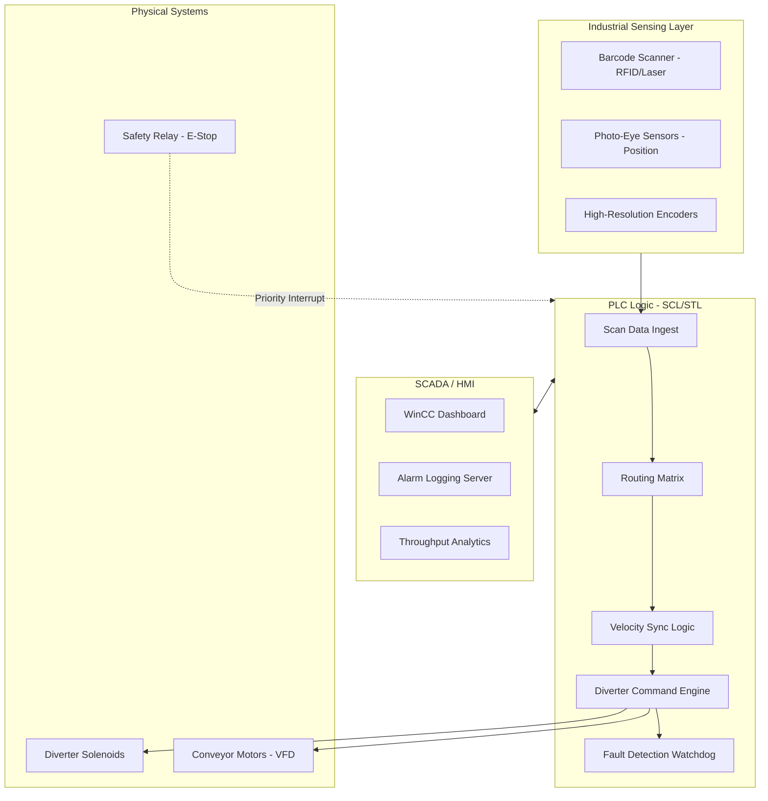

# Airport Baggage Handling Control System
### End-to-End PLC-Based Sortation and Routing Engineering

---

## Problem Statement
Airport baggage handling systems (BHS) are mission-critical infrastructures where a single component failure can cause massive delays and security risks. Traditional systems often lack robust fault-recovery logic and real-time diagnostic visibility.

The Challenge: Engineer a control system that manages high-speed conveyor sortation, ensures "Zero-Collision" routing, and implements automated rerouting logic for hardware failure scenarios (e.g., jammed diverters).

---

## System Architecture and Workflow
The system utilizes a hierarchical control layer where PLC logic handles real-time execution, and a SCADA layer provides centralized monitoring and historical data logging.

---

## Key Technical Features

### 1. PLC Logic Engine (SCL)
- Deterministic Routing: Uses Structured Control Language (SCL) to calculate millisecond-perfect divert timings based on belt velocity and distance-to-divert.
- Collision Avoidance: Implements a "Safe-Gap" algorithm that holds upstream feeders if downstream zones are congested.
- Fault Recovery Logic: Automatically detects diverter jams and re-routes baggage to overflow zones without stopping the entire line.

### 2. Profinet Communication
- Real-time Synchronization: Ensures zero-latency feedback between the PLC and remote I/O nodes.
- Health Monitoring: Continuous heartbeat monitoring of every node on the ring to identify cable breaks or hardware failures immediately.

### 3. SCADA and HMI Visualization
- Real-time Tracking: Visualizes bag flow through the system with dynamic graphic overlays linked to PLC encoders.
- Diagnostic Alarms: Detailed fault reporting that identifies the exact sensor or actuator responsible for a system halt.
- Performance Metrics: Automated calculation of Throughput (Bags per hour) and system availability.

---

## Lead Engineer: Failure Scenarios and Risk Mitigation
| Failure Mode | Detection Logic | Mitigation Strategy |
| :--- | :--- | :--- |
| Diverter Jam | Time-Out on Divert-Home sensor | Automated Reroute to Overflow Zone |
| Photo-Eye Blocked | Static signal > 5 seconds | Trigger "Jam Alarm" and stop upstream VFD |
| Profinet Node Lost | Heartbeat Watchdog Failure | Immediate Controlled Halt of all segments |
| Emergency Stop | Hardwired Priority Input | Instant Power Cut to VFDs via Safety Relays |

---

## Performance Benchmarks
- Throughput: Optimized to handle up to 3,600 bags per hour per sorter module.
- Recovery Time: Automated rerouting reduces downtime by 40% compared to manual intervention systems.
- Sortation Accuracy: 99.9% accuracy via integrated barcode and RFID verification.

---

## Project Structure
- plc_logic/: Core SCL scripts and function blocks for baggage routing.
- hmi_scada/: Tag mapping, display configurations, and visualization specs.
- src/: Python-based system simulation for logic validation.
- docs/: Technical specifications and Profinet network layouts.
