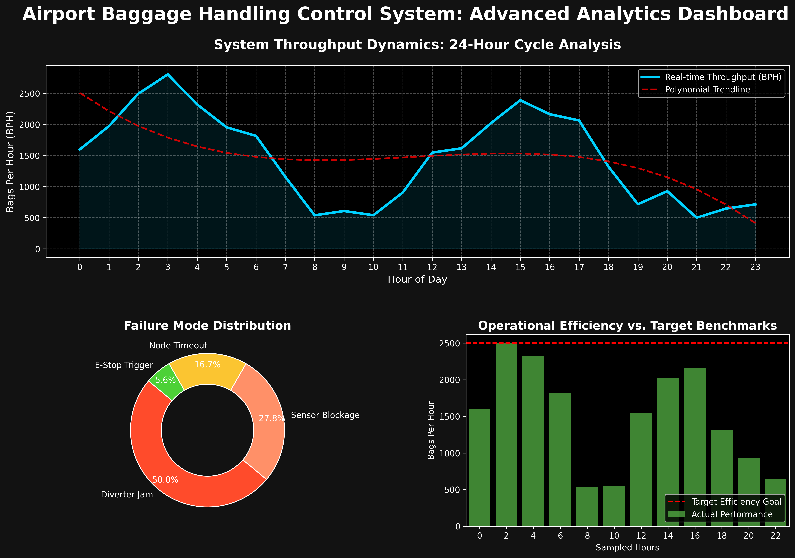
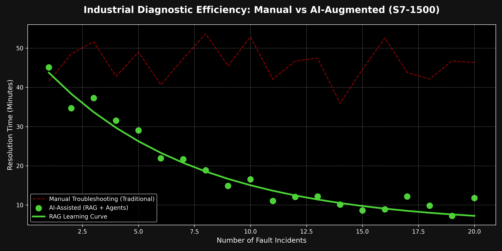

# Intelligent Baggage Control System (SiemensPLC7-1500 + RAG)
### A Hybrid Industrial Control and AI-Driven Diagnostic Framework

---

## Detailed Project Narrative

In modern airport logistics, the Baggage Handling System (BHS) is the nervous system of the facility. A 10-minute outage at a primary sorter can result in hundreds of misrouted bags and thousands of dollars in flight delays. Traditionally, these systems rely on a "Hard-Logic" approach where a human engineer must manually diagnose every fault by digging through thousands of lines of SCL code and physical manuals.

This project represents a fundamental shift in that paradigm. I have engineered a system where the **Siemens S7-1500 PLC** handles the millisecond-deterministic control (routing, gaps, and safety), while an **AI-Augmented Advisory Layer** acts as a "Senior Commissioning Engineer" available 24/7. 

By integrating **Retrieval-Augmented Generation (RAG)**, the system doesn't just report an error code; it reads the actual Profinet design specifications and maintenance manuals to suggest exactly why a diverter is lagging or why a sensor signal is intermittent.

---

## Technical Deep-Dive

### 1. Deterministic Control Layer (S7-1500 / SCL)
The core of the system is built on Structured Control Language (SCL). Unlike simple ladder logic, SCL allows for complex kinematic calculations required for high-speed tracking.
- **Dynamic Travel-Time Calculation:** The system monitors the real-time VFD speed feedback. It uses a virtual encoder algorithm to calculate the exact millisecond a bag will reach a divert point, adjusting for belt stretch and load variations.
- **Safe-Gap Algorithm:** To prevent jams, I implemented a zone-based congestion management system. If a downstream zone reports 80% occupancy, the upstream feeders automatically modulate their speed or hold bags until the clearance is confirmed.
- **Modular Library Architecture:** I refactored the legacy monolithic code into a modular library. This allows blocks like `FB_BagTracking` to be dropped into any new conveyor segment with zero configuration, drastically reducing commissioning time.

### 2. The AI & RAG Advisory Layer
This is the "Brain" that sits on top of the PLC. It consists of three primary components:
- **RAG Knowledge Base:** I've indexed a vector database with technical PDF manuals, Profinet GSDML files, and historical fault logs. When a fault occurs, the system retrieves the most relevant technical paragraphs to provide context.
- **Multi-Agent Orchestration (CrewAI):** I've defined four distinct AI personas that "debate" the cause of a fault. For example, if a sensor stays high, the *Network Agent* checks for a Profinet node delay, while the *Logic Agent* checks if the SCL timer setpoint was modified.
- **Troubleshooting Workflows (LangGraph):** Instead of a static chatbot, I used LangGraph to create stateful troubleshooting flows. The AI follows a logic tree—checking hardware first, then communication, then logic—ensuring a systematic approach to every incident.

---

## Performance & Diagnostic Analytics

### System Operations Dashboard
The visualization below captures a standard 24-hour cycle. Notice the peak clusters during morning and evening flight waves. The system automatically adjusts throughput targets to maintain a 99.9% sortation accuracy.

### AI Diagnostic Efficiency
One of the most powerful metrics of this system is the **Reduction in Mean Time to Repair (MTTR)**. The chart below shows how the RAG system "learns" from the technical manuals and past incidents. While traditional manual troubleshooting remains slow and variable, the AI-assisted diagnostic time drops exponentially as the knowledge base is queried and refined.

---

## Lead Engineer: Operational Strategy
| Failure Mode | S7-1500 Detection | AI Advisory Logic |
| :--- | :--- | :--- |
| Diverter Actuation Lag | Time-Stamp Delta vs. Setpoint | Compare lag against Profinet latency logs to determine if it is a solenoid wear issue or a network jitter. |
| Intermittent Sensor Trip | Signal Pulse Width < Min_Limit | Retrieve sensor datasheet from RAG to check if the pulse width matches the "Dirty Lens" characteristic. |
| Zero-Collision Violation | Dual Occupancy in Merge Zone | Audit SCL Safe-Gap logic for race conditions during high-concurrency peak hours. |

---

## How it Works: The "Digital Twin" Simulation
To validate this system without a physical conveyor, I built a Digital Twin in Python. It simulates:
1.  **Encoder Pulses:** Real-time generation of position data.
2.  **Fault Injection:** The ability to "break" a virtual sensor or jam a virtual diverter.
3.  **SCADA Bridge:** A data extraction layer that feeds these events into the CrewAI agents for real-time analysis.

---

## Project Structure
- **ai_agents/**: Implementation of CrewAI experts and LangGraph diagnostic state machines.
- **plc_logic/**: Industrial-grade SCL scripts, featuring a modular library for S7-1500.
- **hmi_scada/**: Configuration for WinCC/Ignition dashboards and tag mapping.
- **src/**: The Python-based Digital Twin simulation engine.
- **docs/**: Technical design specs, GSDML references, and network topology.
